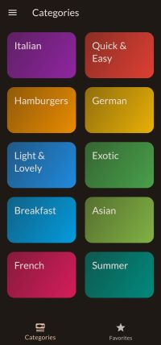

# Meals Explorer App

Meals Explorer is a cross-platform mobile application built using Flutter and Riverpod, designed to help users explore a wide variety of meals. With a focus on usability and customization, Meals Explorer allows users to discover meals based on their preferences, save favorites for future reference, and filter out meals according to dietary restrictions or personal tastes.

## Features

- **Meal Exploration**: Browse through an extensive collection of meals categorized by type.
- **Favorite Meals**: Save your favorite meals for quick access later.
- **Smart Filtering**: Easily filter meals based on dietary preferences, ingredients, or meal types.
- **Cross-Platform Compatibility**: Enjoy the app seamlessly on both iOS and Android devices.
- **Responsive Design**: Ensures optimal viewing and interaction experience across different screen sizes.

## Screenshots

## Getting Started

To get started with Meals Explorer, follow these steps:

1. Clone this repository: `git clone https://github.com/rajafawady/meals_app.git`
2. Navigate to the project directory: `cd meals_app`
3. Install dependencies: `flutter pub get`
4. Run the app: `flutter run`

